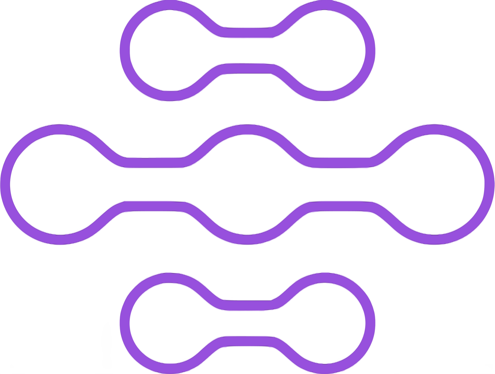

# Chat

<p align="center">
  <a href="https://crahe-arthur.com/">
      
      <h1 align="center">Arthur CRAHÉ</h1>
  </a>
</p>

## Description

In an effort to deepen my understanding of real-time communication and full-stack development, I embarked on creating a simple yet robust multi-room chat application. This project served as a practical learning playground where I could apply cutting-edge technologies in a real-world scenario.

The application allows users to engage in conversations within multiple chat rooms, each potentially serving different topics or user groups. With features such as password-protected rooms, users can create private spaces for more focused discussions. The intuitive UI/UX ensures that users can effortlessly send, edit, or delete their messages, and the state management allows for seamless transitions when leaving or rejoining rooms. Whether for casual chats, collaborative work, or community building, this application provides a versatile platform for communication.

As a developer, this project has been an invaluable experience in working with asynchronous requests, managing WebSocket connections, and ensuring a seamless user experience with responsive design. It has allowed me to refine my skills in both front-end and back-end development, resulting in a comprehensive understanding of the full-stack ecosystem.

## Features

- **Room Management**: Users can create chat rooms with the option to secure them with passwords for privacy. 
- **Persistent Connections**: The chat maintains a persistent connection, allowing users to leave and rejoin without losing the flow of the conversation.
- **Real-time Interactions**: Messages are sent, received, and updated in real-time across clients.
- **User Experience**: A clean and modern interface with seamless interactions, designed with NextUI and TailwindCSS.
- **Message Control**: Users have full control over their messages and can edit or delete them as needed.


## Tech Stack

**Client:** NextJS, React, NextUI, TailwindCSS for a modern, responsive front-end.

**Server:** Node.js with Express for the backend framework, Socket.io for real-time bi-directional event-based communication, and MongoDB for data persistence.

## Screenshots


## Run Locally

Clone the project

```bash
  git clone https://github.com/khylpe/chat
```

Go to the client directory

```bash
  cd chat/client
```

Install dependencies

```bash
  npm install
```

Go to the server directory

```bash
  cd ../server
```

Install dependencies

```bash
  npm install
```

Start the project

```bash
    cd src
    node server.js
    
    cd ../../client
    npm run dev
```

## Environment Variables

To run this project, you will need to add the following environment variables to your .env file

### **Client :**

`NEXTAUTH_SECRET`

`NEXTAUTH_URL`

`JWT_SECRET`

### **Server :**

`MONGODB_URI`